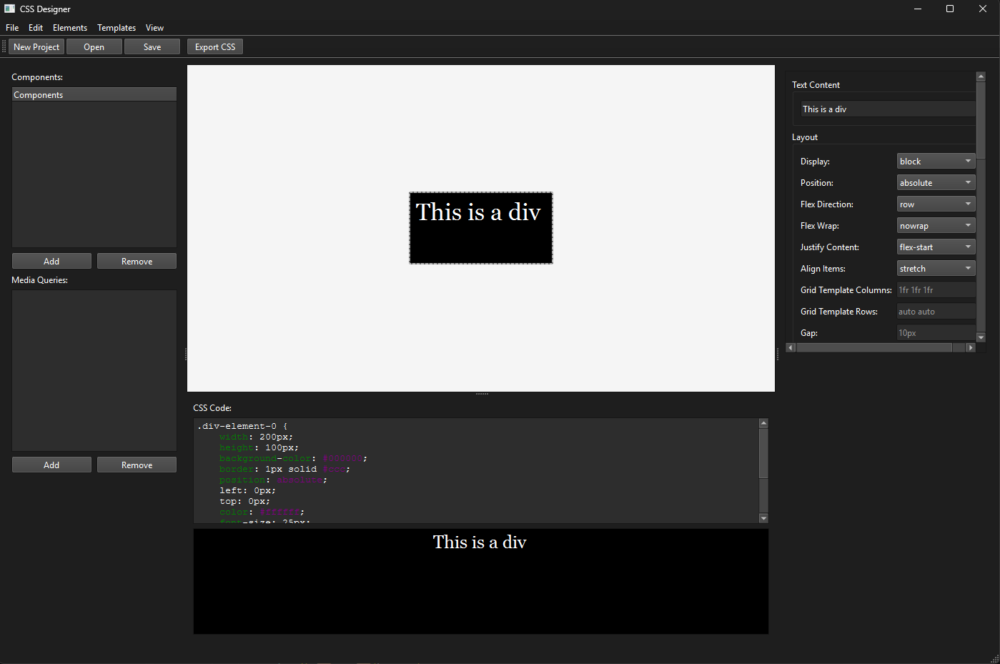

# CSS Designer

A visual CSS editor for creating and editing styles through a graphical interface, similar to Qt Designer, but for web styles.



**English** | **[Русский](README_RU.md)**

## Installation

### Clone the repository

```bash
git clone https://github.com/nazarhktwitch/css-designer
cd css-designer
```

### Install dependencies

```bash
pip install -r requirements.txt
```

### Run

```bash
py app.py
```

## Requirements

For requirements see [requirements.txt](requirements.txt) file

Also, ensure PyInstaller is installed if you plan to build an executable

## Building

To build an executable, run:

```bash
pyinstaller build.spec
```

To customize build options, either edit the [build.spec](build.spec) file or pass the options directly in the command.

## License

MIT License.
See the [LICENSE](LICENSE) file for more information.
