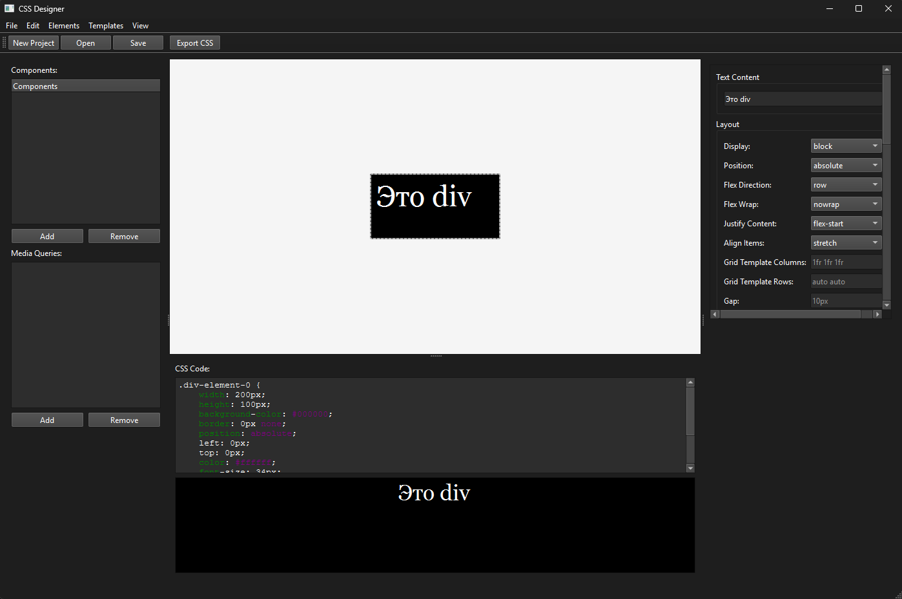

# CSS Designer

Визуальный редактор CSS для создания и редактирования стилей через графический интерфейс, аналогичный Qt Designer, но для веб-стилей.



## Установка

### Клонируйте репозиторий

```bash
git clone https://github.com/nazarhktwitch/css-designer
cd css-designer
```

### Установите зависимости

```bash
pip install -r requirements.txt
```

### Запуск

```bash
py app.py
```

## Требования

Чтобы посмотреть зависимости проекта, проверьте файл [requirements.txt](requirements.txt)

Для сборки убедитесь, что у вас установлен PyInstaller

## Сборка

Чтобы собрать исполняемый файл, используйте команду:

```bash
pyinstaller build.spec
```

Для изменения информации о сборке, редактируйте файл [build.spec](build.spec) или укажите нужную информацию в команде

## Лицензия

Лицензия MIT.
Смотрите файл [LICENSE](LICENSE) для большей информации.
